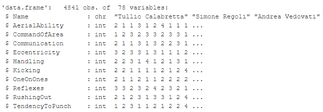
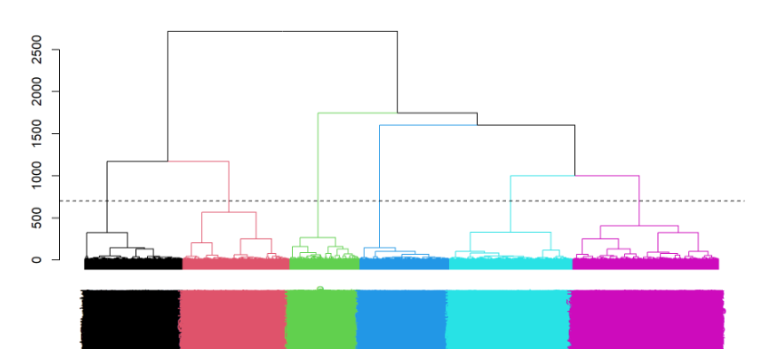
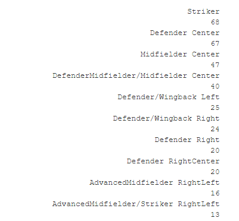
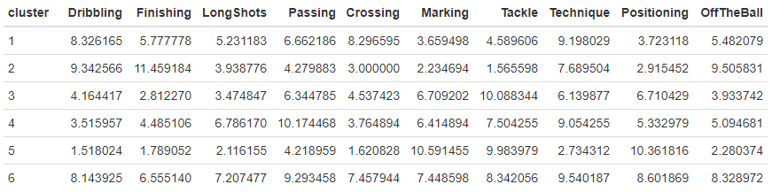
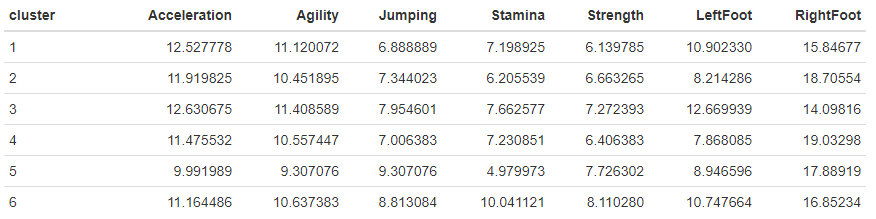
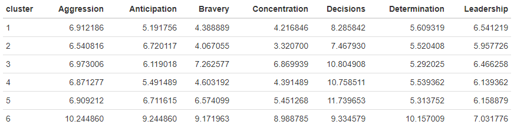

# Who is the next Italian CR7?

``` r
knitr::opts_chunk$set(echo = F, comment = "", warning = F, fig.width = 10)

library(tidyverse)
library(data.table)
library(cluster)
library(dendextend)

target = "Cristiano Ronaldo"
```

### 1. Scope

The purpose of this analysis is to identify the future Italian Cristiano Ronaldo. Young football players under 20 years old in 2017 are considered. The available data comes from the detailed database of the famous manager game for pc, Football Manager 2017.

### 2. Data

``` r
fmdata <- fread("../input/dataset.csv")

fmdata <- fmdata %>% 
  distinct(Name, .keep_all = T) %>% 
  mutate(Role = PositionsDesc)

fmdata$Role <- gsub("GK/S", "GoalKeeper/sweeper", fmdata$Role)
fmdata$Role <- gsub("GK", "GoalKeeper", fmdata$Role)
fmdata$Role <- gsub("D", "Defender", fmdata$Role)
fmdata$Role <- gsub("WB", "Wingback", fmdata$Role)
fmdata$Role <- gsub("M", "Midfielder", fmdata$Role)
fmdata$Role <- gsub("S", "Striker", fmdata$Role)
fmdata$Role <- gsub("C", "Center", fmdata$Role)
fmdata$Role <- gsub("A", "Advanced", fmdata$Role)
fmdata$Role <- gsub("R", "Right", fmdata$Role)
fmdata$Role <- gsub("L", "Left", fmdata$Role)

dati_source <- fmdata %>% 
  filter(NationID == 776, Age < 20) %>%
  filter(!is.element(PositionsDesc,c("GK","GK/S"))) %>% 
  filter(Name != target) %>% 
  select(-c(UID, NationID, Born, Age, IntCaps, IntGoals, 
            U21Caps, U21Goals, Height, Weight, PositionsDesc, Role))

dati_target <- fmdata %>% 
  filter(Name == target) %>% 
  select(-c(UID, NationID, Born, Age, IntCaps, IntGoals, 
            U21Caps, U21Goals, Height, Weight, PositionsDesc, Role))

ds_cluster_target <- bind_rows(dati_source, dati_target) %>% as.data.frame()
```

Dataset contains 4.841 football players (not Goalkeeper) and 78 variables that characterize each player from a physical, technical-tactical and mental point of view with a value between 1 and 20.



### 3. Cluster Analysis

To identify the young Italian football players most similar to Cristiano Ronaldo, based on the characteristics above, we use hierarchical cluster analysis, which is a statistical technique that creates groups (clusters) of observations (the football players in this case) that are similar to each other and different between one group and another. The Euclidean distance between their variables is used to determine the "similarity" or "dissimilarity" between two observations.

``` r
ds_cluster_target[,-1] <- apply(ds_cluster_target[,-1], 2, scale)

rownames(ds_cluster_target) <- ds_cluster_target$Name
ds_cluster_target <- ds_cluster_target[,-1]

distances <- dist(ds_cluster_target)

cluster <- as.dendrogram(hclust(distances, method = "ward.D"))

k = 6

cluster %>%
  hang.dendrogram() %>% 
  set("labels_col", value = 1:k, k = k) %>%
  set("branches_k_color", value = 1:k, k = k) %>%
  plot(horiz = F, axes = T)

abline(h = 700, lty = 2)

gruppi <- cutree(cluster, k)

sil <- silhouette(gruppi, distances)
sil_data <- data.frame(Cluster = sil[,1], Silhouette = sil[,3])
```



### 4. Results

``` r
target_group <- as.numeric(gruppi[names(gruppi) == target])

fmdataClust <- fmdata %>% 
  mutate(cluster = case_when(
    Name %in% names(gruppi[gruppi == 1]) ~ "1",
    Name %in% names(gruppi[gruppi == 2]) ~ "2",
    Name %in% names(gruppi[gruppi == 3]) ~ "3",
    Name %in% names(gruppi[gruppi == 4]) ~ "4",
    Name %in% names(gruppi[gruppi == 5]) ~ "5",
    Name %in% names(gruppi[gruppi == 6]) ~ "6",
    TRUE  ~ NA_character_,
  )) %>% 
  filter(!is.na(cluster))
```

We can observe 6 goups of players. The group that contains CR7 is number 6, that contains others 534 players. Below is the distribution of cluster 6 by field position:



The curious thing we notice is that many players in the cluster are defenders (central or outside) and midfielders ... perhaps they unknowingly chose to play in the wrong role?

Let's look at the average values of the main technical-tactical characteristics by cluster:



Cluster 1 shows high averages for dribbling and crossing and so we can assume it is composed of fluidizing full-backs/side midfielders/wings who can jump the man and go for crosses from the flanks; cluster 2, on the other hand, emerges for high values in dribbling and finalization that suggest a cluster composed of first forwards who need to score goals. Cluster 3 shows high averages in tackling and low values for finalization and shooting and we can think of a cluster of defensive midfielders/center midfielders; in cluster 4 there are players who are good at passing and so we can think of a cluster of midfielders/registers, given also the good value in technique. Cluster 5 is clearly a set of central defenders given that it has the highest averages in marking and tacle while very low values in dribbling and finalization. Finally, cluster 6 is characterized by good values in dribbling, shooting, passing, and technique and thus suggests a group of technically very good football players.

Let us look at the average values of the main physical characteristics by cluster:



Physically, cluster 5 emerges in elevation, confirming that they are central defenders. In acceleration and agility the clusters are equivalent. Cluster 6 emerges in endurance and strength.

Let's look at the average values of the main mental characteristics by cluster:



Mentally, cluster 6 dominates in all areas except decision making. So we can conclude that it is the group of soccer players mentally most similar to Ronaldo and that mental characteristics are the decisive ones in this clustering. Probably, being soccer players with less than 20 years of age, barring some exceptions, the difference between them is made by mentality rather than technical or physical qualities.

``` r
dist <- as.matrix(distances)
r <- dist[rownames(dist) == target,]
r[r==0] <- NA
```

The young Italian football player most similar to Cristiano Ronaldo in 2017, based on Football Manager game, is Federico Bonazzoli.
